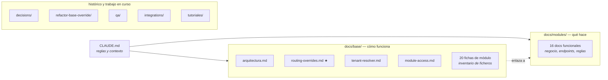

# Documentación del CRM Salamandra

Índice general. Empieza por [`CLAUDE.md`](../CLAUDE.md) en la raíz si es tu
primer contacto con el proyecto; esto es el siguiente nivel de detalle.

---

## Mapa

## Carpetas

| Carpeta | Qué contiene |
| --- | --- |
| [`base/`](base/) | **Cómo funciona el CRM por dentro**: arquitectura, resolución de tenant, mecanismo de overrides, acceso a módulos, convenciones, patrones, despliegue, y una ficha técnica por módulo con su inventario de ficheros. |
| [`modules/`](modules/) | **Qué hace cada módulo**: negocio, endpoints, reglas de validación, decisiones de implementación. Es el detalle funcional. |
| [`decisions/`](decisions/) | **El porqué de las reglas de `CLAUDE.md`**, una decisión fechada por fichero (desde el 19/08/2026: `CLAUDE.md` guarda la regla, aquí vive la historia). Índice en su README. |
| [`refactor-base-override/`](refactor-base-override/) | **Histórico, superado el 18/08/2026** por la regla #16 (los overrides se encogen, no se clonan). Se conserva por el diagnóstico y el método de testing; no retomar el loop. |
| [`qa/`](qa/) | Sprints de QA y sus hallazgos. |
| [`integrations/`](integrations/) | Integraciones con terceros. |
| [`tutoriales/`](tutoriales/) | Guías paso a paso. |

## Atajos

**Voy a tocar un módulo** → el `## Mapa` al principio de
[`modules/{modulo}.md`](modules/) (dónde vive cada cosa, verificado el
19/08/2026) y luego el resto del doc para saber qué hace;
[`base/{modulo}.md`](base/) para el inventario fino de ficheros (foto del
07/08, ver su aviso).

**Un cliente pide algo** → la escalera de la **regla #16 de `CLAUDE.md`**
antes de abrir un fichero: alta sin código → palabras → dato en `lib/` →
interruptor → parámetro → y solo al final pantalla propia. Si acaba en
override, [`base/routing-overrides.md`](base/routing-overrides.md) para el
mecanismo, que tiene trampas que no dan error, solo dejan de funcionar en
silencio.

**Alguien no ve un módulo que sí tiene contratado** →
[`base/module-access.md`](base/module-access.md). Son tres puertas y casi
siempre es la segunda.

**Voy a escribir un script o un smoke test** →
[`base/tenant-resolver.md §5`](base/tenant-resolver.md) para autenticarse, y
[`base/patterns.md §1`](base/patterns.md) para la plantilla.

**Voy a desplegar** → [`base/deploy.md`](base/deploy.md), con el checklist y
los dos errores clásicos de `docker exec`.

**Voy a apuntar una tarea en el backlog** →
[`como-apuntar-en-el-tablero.md`](como-apuntar-en-el-tablero.md). El formato
exacto, las cinco trampas del troceador —que no dan error, solo salen mal— y
por qué hay que desplegar para que la tarea aparezca en el tablero.

## Reglas que no están en la doc porque están en el código

- Si el código y un doc discrepan, **manda el código**. Actualiza el doc.
- Los slugs se escriben **como están en BD** (con underscore) en toda
  documentación nueva.
- Nada de TypeScript, nada de `src/`, terminal PowerShell en local.
