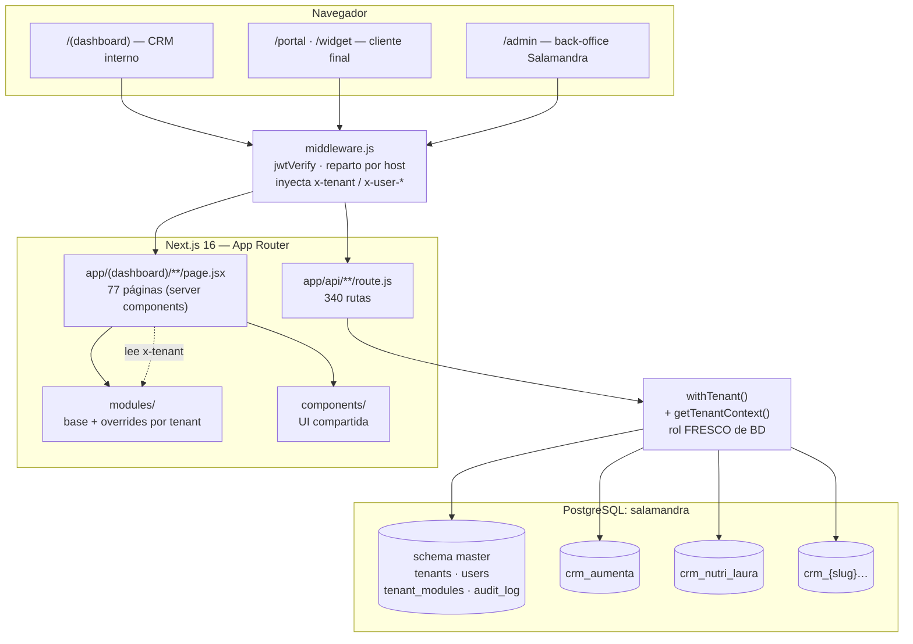

# Arquitectura del CRM

> Cómo encaja todo. Verificado contra código el 2026-08-07 (commit `030a35e`).

---

## 1. Vista general



## 2. Multi-tenant: schema por cliente

Una app, una base de datos (`salamandra`), **un schema PostgreSQL por
tenant**. El schema es la **primera barrera** de aislamiento: dos clientes no
comparten tabla.

```
salamandra
├── master              tenants · users · tenant_modules · audit_log
├── crm_demo
├── crm_aumenta
├── crm_nutri_laura
└── crm_{slug}…
```

- `lib/db/masterDb.js` — singleton a `master`.
- `lib/db/tenantDb.js` — **pool por tenant**, con purga de conexiones ociosas
  cada 5 min. Valida el slug contra `/^[a-z0-9_]+$/`.
- `models/master/` — modelos globales · `models/tenant/` — modelos por schema.

## 3. Las cuatro capas de personalización

De más general a más específica:

| Capa | Mecanismo | Alcance |
| --- | --- | --- |
| **1. Módulos** | `tenant_modules.enabled` | Qué existe para ese cliente. |
| **2. Por módulos** | `lib/clients/vocabulario.js`, `formularioAlta.js` | Comportamiento derivado de **qué módulos tiene**, no de quién es. **Es la forma preferida.** |
| **3. Config del tenant** | `settings.brand`, `featureFlags`, `logicOverrides` | Colores, logo, flags. Datos, no código. |
| **4. Override de UI** | mapa `UI_OVERRIDES` por página | Un componente React distinto. Ver `routing-overrides.md`. |

> **Preferir la capa 2 a la 4.** Un centro nuevo con los mismos módulos sale
> bien de fábrica, sin tocar código (CLAUDE.md, 01/08/2026). El override de UI
> se reserva para cuando un tenant se desvía **de verdad**.
>
> ⚠️ El refactor en curso (`docs/refactor-base-override/`) va en la dirección
> contraria por decisión de producto: un override por tenant y módulo. Ver
> `f0-diagnostico.md`.

## 4. Base vs override

- **Un cambio en un módulo llega a TODOS los tenants que lo tengan**, a la
  vez. Es el comportamiento por defecto y es deliberado.
- Cada módulo grande tiene un **tenant "reina"** cuyas necesidades definen el
  default: `aumenta` manda en lo **clínico**, `nutri_laura` en **nutrición**.
  `demo` **no es reina de nada**: es el escaparate, con datos falsos.
- Por eso *"cambios en Aumenta"* significa casi siempre **el módulo clínico**,
  no un `overrides/aumenta/`.

## 5. Superficies de la app

| Superficie | Ruta | Auth |
| --- | --- | --- |
| CRM interno | `/(dashboard)/*` | JWT en cookie httpOnly |
| Portal del cliente | `/portal/*` | SSO propio, **aislado** del dashboard |
| Widget embebible | `/widget/c/{slug}/*` | Público + CSP `frame-ancestors` por tenant |
| API privada | `/api/*` | JWT + `withTenant` + `hasModule` |
| API pública | `/api/public/*` | Sin token, cabecera `x-tenant` |
| Webhooks | `/api/webhooks/*` | HMAC con secreto por tenant |
| Back-office | `/admin`, `/api/admin`, `/api/provisioning` | Host aparte (`ADMIN_HOST`) + claim `bo` |

## 6. Stack

| Capa | Tecnología |
| --- | --- |
| Front + back | Next.js 16 (App Router + Route Handlers) |
| BD | PostgreSQL · Sequelize |
| Estilos | Tailwind CSS 4 |
| Despliegue | Docker Compose en VPS propio, nginx nativo |
| Automatizaciones | n8n (instancia propia) |
| IA | Claude (Anthropic) + Whisper (OpenAI), **clave por tenant** (BYOK) |
| Lenguaje | **JavaScript puro — nada de TypeScript** |

## 7. Tamaño (2026-08-07)

| Área | Ficheros | LOC |
| --- | ---: | ---: |
| `app/api/**` | 340 | 36.742 |
| `modules/**` | 54 | 30.241 |
| `lib/**` | 224 | 26.155 |
| `app/(dashboard)/**` | 94 | 22.839 |
| `components/**` | 58 | 9.597 |
| `models/**` | 105 | 8.700 |

## 8. Reglas de oro

1. Nunca conectar directo a PostgreSQL — siempre `getTenantContext`.
2. Todo Route Handler envuelto en `withTenant`.
3. `hasModule()` en cada endpoint.
4. Modelos base de tenant en `models/tenant/`; overrides de UI en
   `modules/overrides/{slug}/`.
5. Cambios que afecten al multi-tenant → consultar antes.
6. Módulo nuevo: **modelo → endpoints → frontend**, en ese orden.
7. Nada de TypeScript. Nada de `src/`.
8. Los scripts de migración leen los schemas de `master.tenants` — **nunca
   hardcodear slugs**: la lista difiere entre local y producción.
